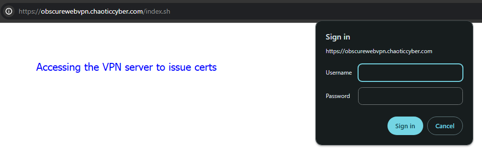
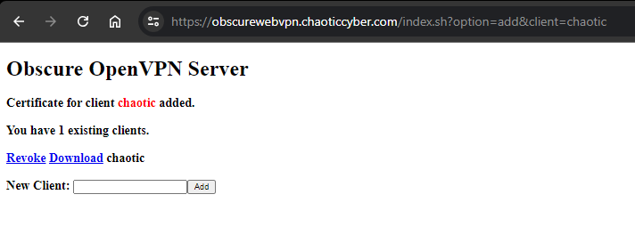

# ObscureWeb101
- Repo contains terraform deployment scripts for building an environment in Azure.
	- VPN server can be accessed at `domain.domain.com/index.sh` (Depends on what you name it in the .tfvars file)
		- When specifying a name for the VPN box, make sure to use something unique or there could be IP conflicts.
	- Windows Hosts will be available for RDP at `<hostname#>.domain.com`
	- An internal Ubuntu host at `10.1.0.52` will be available to each of those hosts internally
# Prerequisites
- Update the .tfvars file. This will be needed for including your Azure IDs, Cloudflare IDs, as well as updating the domain info as necessary
- use `az login` to make Azure happy. (Hit a lot of errors without doing this, didn't feel like troubleshooting at the time)
# Deployment
## Create SSH Keys (If you don't want to use the old ones)
- Create the SSH keys so you can ssh into the VPN server as the user specified in the .tfvars file or as the ansible user (nopass)
    - `ssh-keygen -f ./ssh_keys/ovpn`
## Creating the Hosts
### Windows
- Run the powershell script `./scripts/students.ps1 -count #` (Optional `-name <name> (default=student))`)
	- This will create "#" Windows host files in the current directory named `vm-windows-<name>#`
### Linux / MacOS
- Run the bash script `./scripts/students.sh -c <#>`
	- I did make some updates and only verified the powershell script. This may have errors properly generating the student in an appropriate format.
# Deployment
- Running the below commands will deploy a VPN server, a Windows 11 host(s), and an internal Ubuntu 22.04 box.
    - terraform init
    - terraform plan
    - terraform apply --auto-approve
## Deploying the internal web vulnerable apps
- ssh with `ansible@vpn.domain.com`
- From the home directory choose the vulnerable web app to deploy
    - `./deploy-juicy.sh | ./deploy-goat.sh | ./deploy-dvwa.sh`
# Issuing .ovpn files (If necessary)
- Log into the VPN server
 - `https://vpn.domain.com/index.sh`
 - Use the credentials listed in .tfvars

 - Enter a name and click submit
    - `Download` - This will download the requisite `xxx.ovpn` file.
    - `Revoke` - This will revoke VPN access for that user.

# Windows with WSL-Kali-Kex `https://www.kali.org/docs/wsl/win-kex/`
- Login
    - RDP Access: `<name>#.domain.com`
    - Credentials in `.tfvars`
- Upon login you'll be greeted with a WSL Kali window
	- In this window run `kex` to launch a VNC window with Kali (Will take about 30 seconds to fully load)

# Issues / Thoughts / To-Dos
- When the scripts run cloudflare creates a `<name>.domain.com` A record, however the overwrite flag in the terraform code doesn't seem to delete the existing record and just adds a new one.
    - Manually deleting would be a pain, esp if there was 20 records created.
    - Need a delete CF record script ./delcf sub.domain.com or find another tf way because `allow_overwrite  = true` doesn't work.
- automatically have the atk box runing the vuln services
